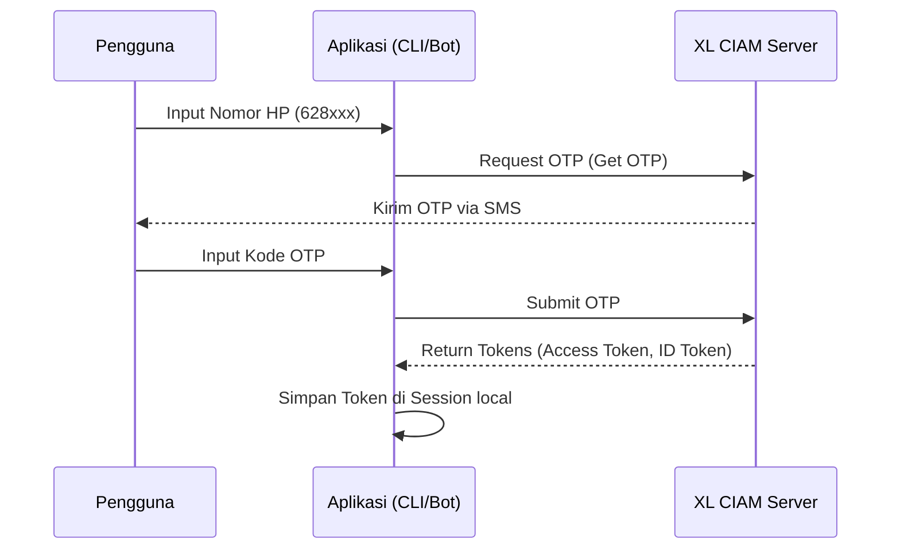

# Dokumentasi Aplikasi: MYnyak Engsel Sunset (XL-CLI)

Dokumentasi ini menjelaskan secara komprehensif mengenai kegunaan, alur kerja, logika internal, fitur, serta kelebihan dan kekurangan dari aplikasi **MYnyak Engsel Sunset (XL-CLI)**.

---

## 1. Kegunaan Aplikasi
Aplikasi **MYnyak Engsel Sunset** adalah alat bantu berbasis Command Line Interface (CLI) dan Telegram Bot yang dirancang khusus untuk mengelola kartu dan melakukan transaksi paket internet pada provider **XL Axiata** di Indonesia. 

Aplikasi ini bertindak sebagai klien alternatif dari aplikasi mobile resmi (MyXL) dengan tujuan mempercepat proses pembelian paket, menjelajahi paket-paket tersembunyi, mengelola paket keluarga (Akrab/Family Plan), serta melakukan bypass pembelian menggunakan metode tertentu (seperti trik *Decoy*).

---

## 2. Alur Kerja (Workflow)

Aplikasi memiliki dua alur antarmuka utama: **CLI Mode** (melalui `main.py`) dan **Telegram Bot Mode** (melalui `telegram_main.py`).

### A. Alur Autentikasi (Login)


### B. Alur Pembelian Paket (Normal & Loop)
1. **Pilih Paket:** Pengguna memilih paket dari menu HOT, Store Segments, atau memasukkan *Option Code/Family Code* secara manual.
2. **Pengambilan Detail:** Aplikasi mengambil informasi detail paket dan `token_confirmation` dari server XL.
3. **Pembayaran:** Aplikasi mengirimkan request penyelesaian (*settlement*) menggunakan pulsa, e-wallet, atau QRIS.
4. **Verifikasi:** Jika status transaksi sukses, paket langsung aktif.

---

## 3. Logika Internal & Kriptografi

Keunikan utama dari aplikasi ini adalah kemampuannya meniru aplikasi mobile MyXL dalam berkomunikasi dengan server XL Axiata. Hal ini dilakukan melalui modul enkripsi di `app/client/encrypt.py` dan `app/service/crypto_helper.py`.

### A. Enkripsi Data Payload (XDATA)
Setiap data body (JSON payload) yang dikirim ke server XL wajib dienkripsi menggunakan algoritma **AES-CBC**.
* **Key:** Diambil dari variabel `.env` (`XDATA_KEY`).
* **Initialization Vector (IV):** Diturunkan secara dinamis berdasarkan nilai timestamp milidetik (`xtime_ms`) yang di-hash dengan SHA-256 lalu diambil 16 karakter pertamanya.
* **Hasil:** Dikirim sebagai payload terenkripsi berupa string Base64 dalam field `xdata` beserta nilai `xtime`.

### B. Tanda Tangan API (Signatures)
Setiap request wajib menyertakan signature di header untuk validasi integritas:
* **`x-signature`**: Dibuat dengan format HMAC-SHA512 menggunakan `X_API_BASE_SECRET` digabungkan dengan Token, HTTP Method, Path API, dan Signature Time.
* **`x-signature-time`**: Waktu tanda tangan dalam satuan detik.
* **`x-api-signature`**: Digunakan untuk alur autentikasi/OTP.
* **`x-request-id`**: UUID acak untuk melacak keunikan request.

### C. Logika Decoy (Bypass Pembelian)
Trik *Decoy* digunakan untuk memuluskan pembelian paket-paket tertentu (terutama paket Rp0 atau paket promo khusus):
1. Aplikasi memuat informasi paket pancingan (*decoy package*) yang murah atau gratis dari folder `decoy_data/`.
2. Saat membeli paket target, aplikasi memasukkan **dua item sekaligus** ke dalam keranjang belanja (`PaymentItem` target + `PaymentItem` decoy).
3. Jika total harga tidak sesuai, server akan mengembalikan error berisi nominal harga yang valid (`Bizz-err.Amount.Total=X`).
4. Aplikasi secara otomatis menangkap error tersebut, mengekstrak nilai nominal asli, menyesuaikan jumlah pembayaran (*overwrite_amount*), lalu melakukan request ulang (*retry*) hingga sukses.

---

## 4. Fitur Utama

Aplikasi ini kaya akan fitur-fitur manajemen kartu XL:

* **Manajemen Multi-Akun:** Login banyak nomor, berpindah akun dengan cepat, dan menghapus sesi.
* **Pembelian Paket Fleksibel:**
  * Pembelian Paket 🔥 HOT 🔥 & 🔥 HOT 2 🔥.
  * Pembelian berdasarkan *Option Code* atau *Family Code* secara langsung.
  * Pembelian berulang (*looping purchase*) otomatis dengan delay dan decoy.
* **Beragam Metode Pembayaran:**
  * Pulsa (Prepaid Balance).
  * E-Wallet (DANA, ShopeePay, GoPay, OVO) dengan input nomor HP e-wallet secara interaktif.
  * QRIS (Mendapatkan kode QRIS mentah dan mengecek status settlement pembayaran secara realtime).
* **Family Plan (Paket Akrab Organizer):**
  * Melihat data anggota keluarga.
  * Menambah, mengganti, dan menghapus anggota paket Akrab.
  * Mengatur limit kuota masing-masing anggota (dalam MB/GB).
* **Circle (Bonus Sharing):**
  * Mengundang anggota ke lingkaran bonus, menghapus anggota, menerima undangan, serta mengklaim bonus Circle.
* **Fitur Tambahan:**
  * Registrasi kartu baru (Dukcapil NIK & KK).
  * Validasi nomor MSISDN tujuan.
  * Bookmark paket untuk menyimpan kode paket favorit agar mudah diakses di kemudian hari.
  * Pembatasan akses bot Telegram menggunakan file whitelist `user_allow.txt`.
  * Fitur auto-update otomatis melalui integrasi Git.

---

## 5. Kelebihan Aplikasi

* **Otomatisasi & Efisiensi:** Memungkinkan pembelian paket secara massal/berulang yang tidak bisa dilakukan lewat aplikasi resmi MyXL.
* **Bypass Proteksi (Decoy):** Adanya fitur bypass limit pembayaran total memungkinkan aktivasi paket-paket promo khusus.
* **Dukungan Lintas Platform:** Dapat berjalan langsung di CLI (Termux, Linux, Windows) maupun didelegasikan ke Telegram Bot sebagai kontrol panel jarak jauh.
* **Antarmuka Telegram yang Interaktif:** Telegram bot didukung dengan sistem tombol inline (*button-driven*), navigasi halaman (*pagination*), dan panel status yang menyerupai aplikasi GUI.
* **Keamanan Akses Bot:** Dilengkapi whitelist ID Telegram (`user_allow.txt`) agar bot tidak bisa disalahgunakan oleh orang lain jika dideploy secara publik.

---

## 6. Kekurangan Aplikasi

* **Ketergantungan pada Nilai Statis:** Versi aplikasi (`x-version-app: 8.9.0`) dan format header didefinisikan secara statis. Jika XL mewajibkan pembaruan versi minimum aplikasi secara ketat di server-side, aplikasi ini akan berhenti bekerja hingga kodenya disesuaikan.
* **Konfigurasi Kunci Enkripsi yang Rumit:** Pengguna harus mengisi kunci-kunci rahasia API (`XDATA_KEY`, `AX_API_SIG_KEY`, dll) di file `.env`. Kunci-kunci ini biasanya diperoleh dengan melakukan reverse engineering / dekompilasi aplikasi MyXL resmi, sehingga sulit diperbarui oleh pengguna awam jika terjadi perubahan kunci dari pihak XL.
* **Ketergantungan Eksternal:** Layanan QRIS dan E-Wallet bergantung pada kestabilan payment gateway pihak ketiga milik XL.

---

## 7. Bug & Masalah yang Sering Terjadi (Known Issues)

* **Error Decrypt [decrypt err]:** Terjadi apabila respons dari server XL tidak menggunakan enkripsi (misal ketika server down, IP terblokir/WAF, atau token kedaluwarsa). Akibatnya fungsi dekripsi gagal membaca data JSON.
* **Bizz-err / Timeout:** Sering terjadi ketika melakukan pembelian beruntun tanpa delay. Server XL menerapkan rate limit yang cukup ketat sehingga request bisa diblokir sementara.
* **Session Expired tanpa Notifikasi Jelas:** Token sesi (ID Token) memiliki masa kedaluwarsa. Kadang aplikasi menampilkan error umum bukannya langsung meminta pengguna untuk re-login.

---

## 8. Persyaratan & Instalasi Singkat

### Variabel Lingkungan (`.env`)
Untuk menjalankan aplikasi, Anda memerlukan file `.env` yang berisi parameter berikut:
```env
BASE_API_URL="https://.../api-url"
BASE_CIAM_URL="https://.../ciam-url"
BASIC_AUTH="Basic ..."
AX_FP_KEY="key_fingerprint_here"
UA="User-Agent-Here"
API_KEY="key_api_here"
ENCRYPTED_FIELD_KEY="key_encrypted_field_here"
XDATA_KEY="key_xdata_here"
AX_API_SIG_KEY="key_signature_here"
X_API_BASE_SECRET="secret_base_here"
CIRCLE_MSISDN_KEY="key_circle_msisdn_here"
```

### Cara Menjalankan
1. **Instalasi Dependensi:**
   ```bash
   bash setup.sh
   # atau untuk Windows (PowerShell):
   .\setup.ps1
   ```
2. **Menjalankan CLI:**
   ```bash
   python main.py
   ```
3. **Menjalankan Telegram Bot:**
   ```bash
   python telegram_main.py
   ```
4. **Menggunakan Panel Kontrol:**
   ```bash
   paneldor
   ```
